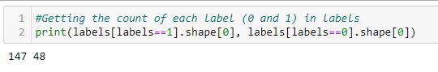

## Parkinson-disease-prediction

> ### Objective

To build a model to accurately detect the presence of Parkinson’s disease in an individual.

> ### What is Parkinson’s Disease?

Parkinson’s disease is a progressive disorder of the central nervous system affecting movement and inducing tremors and stiffness. It has 5 stages to it and affects more than 1 million individuals every year in India. This is chronic and has no cure yet. It is a neurodegenerative disorder affecting dopamine-producing neurons in the brain.

> ### What is XGBoost?

XGBoost is a new Machine Learning algorithm designed with speed and performance in mind. XGBoost stands for eXtreme Gradient Boosting and is based on decision trees. In this project, we will import the XGBClassifier from the xgboost library; this is an implementation of the scikit-learn API for XGBoost classification.

> ### About the Python Machine Learning Project

In this Python machine learning project, using the python libraries, numpy, pandas, and xgboost, we will build a model using an XGBClassifier. We’ll load the data, get the features and labels, scale the features, then split the dataset, build an XGBClassifier, and then calculate the accuracy of our model.

> ### Dataset for Python Machine Learning Project

The UCI ML Parkinsons dataset has been used for this project and can [***downloaded from here***](https://archive.ics.uci.edu/ml/machine-learning-databases/parkinsons/). The     dataset has 24 columns and 195 records.

> ### Extracting the features and labels

Features and labels from the dataset are extracted.The features are all the columns except ‘status’, and the labels are those in the ‘status’ column. The ‘status’ column has values 0 and 1 as labels; 

​                                      0: No parkinson disease    1: Parkinson disease

> ### Count of labels

The code below prints thie count of labels

The count of labels is also depicted using a pie chart

> ### Correlation between features

A heat map was plotted to show a correlation between features

> ### Initiating the classifier and predicting accuracy

The XGB classifier was initialized and the accuracy for the model was predicted to be 94.8

​                                      